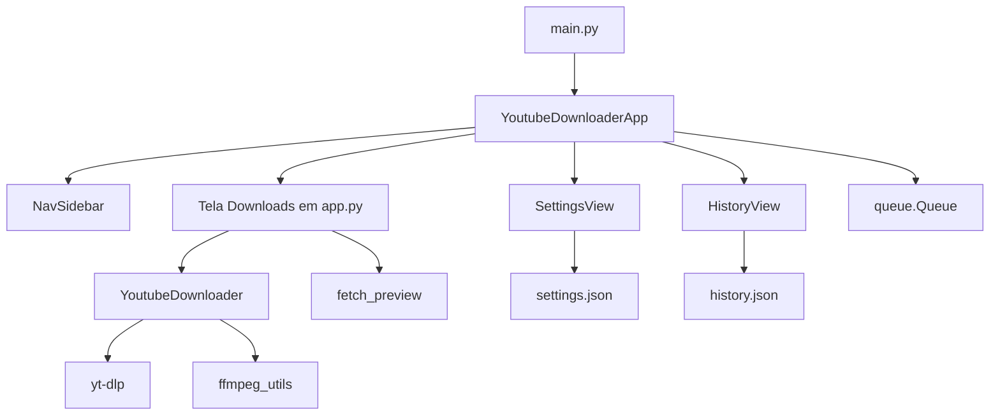

# Guia para agentes — YouTube Downloader

Manual de arquitetura e convenções para Cursor, copilotas e contribuidores. Leia antes de alterar código ou afirmar que uma feature “já funciona”.

## Stack

| Camada | Tecnologia |
|--------|------------|
| Linguagem | Python 3.10+ |
| UI | CustomTkinter + tkinter |
| Download | yt-dlp |
| Imagens | Pillow |
| Mídia | FFmpeg (PATH, `%LOCALAPPDATA%\ffmpeg`, `vendor/ffmpeg` ou embutido no `.exe`) |
| Build | PyInstaller (`build.ps1`, `YouTubeDownloader.spec`) |
| Testes | pytest (`pytest.ini`, `pythonpath = src`) |

## Comandos úteis

```powershell
python main.py                    # app em dev
python -m youtube_downloader      # a partir de src/
python -m pytest                  # testes
.\build.ps1                       # .exe + FFmpeg em dist\
.\update-deps.ps1                 # atualizar yt-dlp
```

## Layout do repositório

```
main.py                           # launcher (insere src/ no path)
src/youtube_downloader/
  config.py                       # constantes, QUALITY_FORMATS, APP_VERSION, PROJECT_ROOT
  app.py                          # shell da janela (~1250 linhas): navegação, Downloads, eventos
  core/                           # sem dependência de Tk
    downloader.py                 # YoutubeDownloader + yt-dlp
    metadata.py                   # preview (fetch_preview, VideoPreview)
    settings.py                   # AppSettings, load/save settings.json
    download_history.py           # history.json
    models.py                     # DownloadJob, ProgressEvent, EventType
    ffmpeg_utils.py               # localizar FFmpeg
    logging_config.py             # logs em logs/
    text_utils.py                 # truncate, strip_ansi
  ui/
    theme.py                      # cores e estilos de botões
    nav_sidebar.py                # sidebar Downloads / Biblioteca / Histórico / Configurações
    settings_view.py              # página Configurações
    history_view.py               # página Histórico
tests/                            # pytest
```

Dados locais na **raiz do projeto** (dev) ou ao lado do `.exe` (dist): `settings.json`, `history.json`, `downloads/`, `logs/`. Não versionar (ver `.gitignore`).

## Arquitetura em alto nível



### Responsabilidades

- **`app.py`**: janela principal, `_build_download_view`, preview com debounce, `_start_download` / `_cancel_download`, `_poll_queue` → `_handle_event`, persistência de settings ao baixar, placeholders (Biblioteca).
- **`core/`**: toda lógica testável sem UI; callbacks `on_event(ProgressEvent)` no download.
- **`ui/`**: componentes visuais; views recebem callbacks (`on_save`, `on_open_path`, `on_select`).

## Fluxo de download (threading)

Tk **não** é thread-safe. Padrão obrigatório:

1. Main thread: usuário clica Baixar → `_start_download` monta `DownloadJob` → inicia `threading.Thread` worker.
2. Worker: `YoutubeDownloader.download(job, on_event)` chama `on_event(ProgressEvent)` → `queue.put`.
3. Main thread: `after(50, _poll_queue)` drena a fila → `_handle_event` atualiza widgets.

Nunca atualizar CustomTkinter a partir do worker.

## Fluxo de preview

1. URL alterada → debounce (`PREVIEW_DEBOUNCE_MS`) → thread busca `fetch_preview`.
2. Eventos `PREVIEW_LOADING` / `PREVIEW_READY` / `PREVIEW_CLEAR` na mesma fila ou lógica equivalente em `app.py`.
3. Thumbnails em `logs/cache/`; limpeza via `clear_preview_cache`.

## Implementado vs. pendente

| Área | Status |
|------|--------|
| Download vídeo/playlist, qualidade, áudio MP3, merge MP4 | Implementado (`downloader`, `config.QUALITY_FORMATS` DASH-first) |
| Preview título/thumbnail | Implementado (`metadata`) |
| Sidebar, Configurações, Histórico | Implementado |
| Biblioteca | Placeholder apenas (`_build_placeholder_view`) |
| Persistência `settings.json` / `history.json` | Implementado |
| Campos avançados em `AppSettings` (idioma, formato vídeo, bitrate, banda, notificações, legendas) | Salvos na UI e JSON |
| Esses campos no yt-dlp / `DownloadJob` | **Não ligados** — `DownloadJob` só: `url`, `output_dir`, `quality`, `audio_only`, `download_playlist` (ver `app.py` ~`_start_download`) |
| Notificações ao concluir | UI + settings; sem integração no fim do download |
| Tema claro/escuro | Não implementado (apenas dark em `app`) |

**Regra:** não assumir que um toggle em Configurações altera o download até existir no `DownloadJob` e em `YoutubeDownloader._build_opts` (ou equivalente).

## Padrões de código (resumo)

- Logging: `from youtube_downloader.core.logging_config import get_logger` → `logger = get_logger(__name__)`.
- Configuração: dataclass + `_coerce_*` ao carregar JSON inválido.
- UI: strings em português; nomes de símbolos em inglês.
- Estilos: importar de `ui.theme`, não hardcodar cores espalhadas.
- Imports: `youtube_downloader.*` (pacote em `src/`).
- Diff mínimo; seguir estilo dos arquivos vizinhos.

Detalhes: regras em [`.cursor/rules/`](.cursor/rules/) e [CONTRIBUTING.md](CONTRIBUTING.md).

## Backlog de refatoração

### Deve (quando mexer na área)

1. **Extrair `DownloadsView`** de `app.py` para `ui/downloads_view.py` — mover `_build_download_view` e handlers de preview/download; `app` fica shell + fila de eventos.
2. **Ligar settings ao downloader** — estender `DownloadJob` e opções yt-dlp para `video_format`, `audio_bitrate`, `bandwidth_limit_kbps`, legendas, etc.

### Pode (baixa urgência)

3. Unificar mapas `QUALITY_DISPLAY_LABELS` / `QUALITY_FROM_DISPLAY` usados em `app.py` e `settings_view.py`.
4. Tipar `ProgressEvent.preview` como `Optional[VideoPreview]`.
5. Renomear `_show_preferences` → `_open_settings` (legado do diálogo antigo).

### Evitar

- Reestruturação “big bang” de `app.py` num único PR.
- Camadas extras (services/repositories) sem necessidade.
- `ruff`/`mypy` sem pedido explícito do mantenedor.

## Refatoração segura

1. PR/commit de estrutura separado de mudança de comportamento.
2. Extrair código, rodar `pytest`, depois evoluir.
3. Ao extrair função pura de `app.py`, adicionar teste em `tests/`.
4. Novas telas: arquivo em `ui/` + entrada em `NavSidebar.ITEMS` + `_view_frames`.

Ver regra [`.cursor/rules/refactoring.mdc`](.cursor/rules/refactoring.mdc).

## Versão

`APP_VERSION` em `src/youtube_downloader/config.py` — alinhar com tags de release no GitHub quando publicar `.exe`.

## Links

- [README.md](README.md) — instalação, uso, release
- [ROADMAP.md](ROADMAP.md) — backlog de produto
- [CONTRIBUTING.md](CONTRIBUTING.md) — PR e Git
