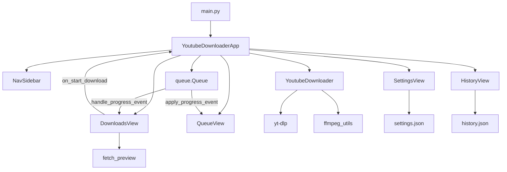

# Guia para agentes — YouTube Downloader

Manual de arquitetura e convenções para Cursor, copilotas e contribuidores. Leia antes de alterar código ou afirmar que uma feature “já funciona”.

## Stack

| Camada | Tecnologia |
|--------|------------|
| Linguagem | Python 3.10+ |
| UI | CustomTkinter + tkinter |
| Download | yt-dlp |
| Imagens | Pillow |
| Mídia | FFmpeg (PATH, `%LOCALAPPDATA%\ffmpeg`, `vendor/ffmpeg` ou embutido no `.exe`) |
| Build | PyInstaller (`build.ps1`, `YouTubeDownloader.spec`) |
| Testes | pytest (`pytest.ini`, `pythonpath = src`) |

## Comandos úteis

```powershell
python main.py                    # app em dev
python -m youtube_downloader      # a partir de src/
python -m pytest                  # testes
.\build.ps1                       # .exe + FFmpeg em dist\
.\update-deps.ps1                 # atualizar yt-dlp
```

## Layout do repositório

```
main.py                           # launcher (insere src/ no path)
src/youtube_downloader/
  config.py                       # constantes, QUALITY_FORMATS, APP_VERSION, PROJECT_ROOT
  app.py                          # shell da janela (~500 linhas): nav, fila, worker, About
  core/                           # sem dependência de Tk
    downloader.py                 # YoutubeDownloader, build_ytdl_opts, yt-dlp
    download_job_builder.py       # DownloadJob a partir de AppSettings + UI
    metadata.py                   # preview (fetch_preview, VideoPreview)
    settings.py                   # AppSettings, load/save settings.json
    download_history.py           # history.json
    models.py                     # DownloadJob, ProgressEvent, EventType
    notifications.py              # notificação desktop ao concluir download
    ffmpeg_utils.py               # localizar FFmpeg
    logging_config.py             # logs em logs/
    preview_cache.py              # cache + prefetch de metadados (fila/cards)
    text_utils.py                 # truncate, strip_ansi
  ui/
    theme.py                      # cores e estilos de botões
    nav_sidebar.py                # sidebar Downloads / Fila / Biblioteca / Histórico / Configurações
    downloads_view.py             # tela Downloads (URL, preview, log, + Fila, Baixar/Cancelar)
    queue_view.py                 # tela Fila (baixando agora + pendentes)
    settings_view.py              # página Configurações
    history_view.py               # página Histórico
tests/                            # pytest (incl. test_download_opts.py)
```

Dados locais na **raiz do projeto** (dev) ou ao lado do `.exe` (dist): `settings.json`, `history.json`, `downloads/`, `logs/`. Não versionar (ver `.gitignore`).

## Arquitetura em alto nível



### Responsabilidades

- **`app.py`**: janela principal, sidebar + navegação, `_poll_queue` → `_handle_event` (delega à `DownloadsView` e `QueueView`), `PreviewCache`, `_sync_queue_structure` / `update_card`, `_run_download_job` (thread + `YoutubeDownloader`), histórico/settings wiring, diálogo Sobre (sidebar), notificação ao `DONE`.
- **`ui/downloads_view.py`**: URL, preview (debounce + worker), opções locais, pasta, log, **+ Fila**, **Baixar** / **Cancelar** no rodapé; `get_now_playing_meta()` para a tela Fila; `force_release_download_ui` se o evento terminal falhar.
- **`ui/queue_view.py`**: card *Baixando agora* (miniatura, título, barra, Cancelar/Pular) e card *Na fila* (lista, limpar, remover).
- **`core/`**: lógica testável sem Tk; `build_ytdl_opts(job)` mapeia `DownloadJob` → opções yt-dlp.
- **`ui/`** (demais views): componentes visuais; callbacks no `__init__` (`on_save`, `on_open_path`, `on_select`).

## Fluxo de download (threading)

Tk **não** é thread-safe. Padrão obrigatório:

1. Main thread: usuário clica Baixar → `DownloadsView` monta `DownloadJob` (`build_download_job` + `AppSettings`) → `on_start_download` → `app._run_download_job` inicia worker.
2. Worker: `YoutubeDownloader.download(job, on_event)` chama `on_event(ProgressEvent)` → `queue.put`.
3. Main thread: `after(50, _poll_queue)` drena a fila → `app._handle_event` → `DownloadsView.handle_progress_event`; ao terminar o worker, `force_release_download_ui` se a UI ainda estiver travada.

Nunca atualizar CustomTkinter a partir do worker.

## Fluxo de preview

1. URL alterada → debounce (`PREVIEW_DEBOUNCE_MS`) → thread busca `fetch_preview`.
2. Eventos `PREVIEW_LOADING` / `PREVIEW_READY` / `PREVIEW_CLEAR` na fila do shell; UI em `downloads_view.py`.
3. Thumbnails em `logs/cache/`; limpeza via `clear_preview_cache`.

## Implementado vs. pendente

| Área | Status |
|------|--------|
| Download vídeo, qualidade, áudio MP3, merge MP4/WebM | Implementado (`downloader`, `build_ytdl_opts`; sempre `noplaylist`) |
| Playlists → fila (N vídeos) | Implementado (`core/playlist_urls.py`, expand + fila) |
| Preview título/thumbnail | Implementado (`metadata`) |
| Sidebar, Configurações, Histórico, Biblioteca | Implementado (`ui/*_view.py`) |
| Fila de downloads | Implementado (sequencial; tela **Fila** na sidebar — ver [docs/ux-downloads-queue.md](docs/ux-downloads-queue.md)) |
| Abrir pasta/arquivo, histórico (↻, 📄) | Implementado |
| Persistência `settings.json` / `history.json` | Implementado |
| Campos avançados + cookies + tema | Implementado em `DownloadJob` / `AppSettings` / `build_ytdl_opts` |
| Perfil de exportação (`export_profile`) | `compatible` (H.264/AAC ou VP9/Opus em WebM) vs `max_quality`; ver `core/format_selectors.py` |
| Idioma (`AppSettings.language`) | Só legendas no yt-dlp; UI em português (rótulo “Idioma das legendas”) |
| Notificações ao concluir | Implementado (`core/notifications.py`) |
| Backlog de produto | [ROADMAP.md](ROADMAP.md) — drag-and-drop, MKV, i18n, etc. |

**Regra:** opções avançadas só valem no download após **Salvar** em Configurações (ou já persistidas em `settings.json`). Campos da tela Downloads (pasta, qualidade, áudio) são gravados ao baixar.

## Padrões de código (resumo)

- Logging: `from youtube_downloader.core.logging_config import get_logger` → `logger = get_logger(__name__)`.
- Configuração: dataclass + `_coerce_*` ao carregar JSON inválido.
- UI: strings em português; nomes de símbolos em inglês.
- Estilos: importar de `ui.theme`, não hardcodar cores espalhadas.
- Imports: `youtube_downloader.*` (pacote em `src/`).
- Diff mínimo; seguir estilo dos arquivos vizinhos.

Detalhes: regras em [`.cursor/rules/`](.cursor/rules/) e [CONTRIBUTING.md](CONTRIBUTING.md).

## Depuração de bugs (agentes)

Ao investigar ou corrigir um bug reportado pelo usuário:

1. Ler **`logs/errors.log`** (últimas linhas) e, se necessário, **`logs/app.log`** na raiz do projeto (dev) ou ao lado do `.exe` (dist).
2. Erros em botões/comandos Tk costumam aparecer como `Exceção em callback da interface` (`youtube_downloader.ui.callback`) — hook em `install_ui_exception_logging` após criar a janela.
3. Exceções na thread principal ou em workers de download: `youtube_downloader.unhandled` (hooks em `install_exception_hooks`).
4. Reproduzir o fluxo na UI se o log não for conclusivo; não assumir causa só pelo sintoma visual.

## Skills Cursor (playbooks)

Procedimentos em [`.cursor/skills/`](.cursor/skills/) — invoque pelo nome ou quando a tarefa combinar com a descrição.

| Skill | Quando usar |
|-------|-------------|
| `youtube-downloader-feature` | Opção → `AppSettings` → `DownloadJob` → `build_ytdl_opts` |
| `youtube-downloader-ui-view` | Telas em `ui/`, wiring em `app.py`, threading — ver [docs/ux-downloads-queue.md](docs/ux-downloads-queue.md) |
| `youtube-downloader-logging` | Ao implementar feature — checklist de onde logar |
| `youtube-downloader-bugfix` | Investigar/corrigir bug — começar por `logs/errors.log` |
| `youtube-downloader-release` | Versão, `build.ps1`, zip, FFmpeg em `dist/` |
| `youtube-downloader-code-review` | Revisar diff antes do merge (read-only primeiro) |
| `youtube-downloader-refactor-extract` | Extrair de `app.py` sem big-bang |

Fluxo sugerido: implementar → `youtube-downloader-logging` (checklist) → `pytest` → `youtube-downloader-code-review` → corrigir → PR. Para bugs: `youtube-downloader-bugfix` → `pytest` → PR.

## Backlog de refatoração

### Deve (quando mexer na área)

1. ~~**Extrair `DownloadsView`**~~ — feito (`ui/downloads_view.py`).
2. ~~**Ligar settings ao downloader**~~ — feito (`DownloadJob`, `build_ytdl_opts`, `build_download_job`).

### Pode (baixa urgência)

3. ~~Unificar mapas de qualidade~~ — rótulos em `config.py` (`QUALITY_DISPLAY_LABELS`); consumidos por `downloads_view` e `settings_view`.
4. ~~Tipar `ProgressEvent.preview`~~ — feito (`Optional[VideoPreview]` em `models.py`).
5. ~~Renomear `_show_preferences` → `_open_settings`~~ — feito em `app.py`.

### Evitar

- Reestruturação “big bang” de `app.py` num único PR.
- Camadas extras (services/repositories) sem necessidade.
- `ruff`/`mypy` sem pedido explícito do mantenedor.

## Refatoração segura

1. PR/commit de estrutura separado de mudança de comportamento.
2. Extrair código, rodar `pytest`, depois evoluir.
3. Ao extrair função pura de `core/` ou views, adicionar teste em `tests/` (ex.: `test_download_opts.py` para `build_ytdl_opts`).
4. Novas telas: arquivo em `ui/` + entrada em `NavSidebar.ITEMS` + `_view_frames` em `app.py`.
5. Em `CTkLabel`, não usar `border_width` / `border_color` — usar `CTkFrame` com borda (ver `history_view.py`).

Ver regra [`.cursor/rules/refactoring.mdc`](.cursor/rules/refactoring.mdc).

## Versão

`APP_VERSION` em `src/youtube_downloader/config.py` — alinhar com tags de release no GitHub quando publicar `.exe`.

## Links

- [README.md](README.md) — instalação, uso, release
- [ROADMAP.md](ROADMAP.md) — backlog de produto
- [CONTRIBUTING.md](CONTRIBUTING.md) — PR e Git
- [docs/ux-downloads-queue.md](docs/ux-downloads-queue.md) — fluxo URL, fila, Baixar, cancelar
- [`.cursor/skills/`](.cursor/skills/) — playbooks Cursor
