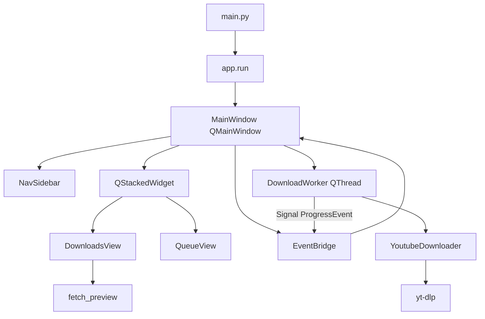

# Guia para agentes — YouTube Downloader

Manual de arquitetura e convenções para Cursor, copilotas e contribuidores. Leia antes de alterar código ou afirmar que uma feature “já funciona”.

## Stack

| Camada | Tecnologia |
|--------|------------|
| Linguagem | Python 3.10+ |
| UI | PySide6 (Qt) — pacote `ui_qt/` |
| Download | yt-dlp |
| Imagens | Pillow |
| Mídia | FFmpeg (PATH, `%LOCALAPPDATA%\ffmpeg`, `vendor/ffmpeg` ou embutido no `.exe`) |
| Build | PyInstaller (`build.ps1`, `YouTubeDownloader.spec`) |
| Testes | pytest (`pytest.ini`, `pythonpath = src`) |

## Comandos úteis

```powershell
python main.py                    # app em dev
python -m youtube_downloader      # a partir de src/
python -m pytest                  # testes
.\build.ps1                       # .exe + FFmpeg em dist\
.\update-deps.ps1                 # atualizar yt-dlp
```

## Layout do repositório

```
main.py                           # launcher (insere src/ no path)
src/youtube_downloader/
  config.py                       # constantes, QUALITY_FORMATS, APP_VERSION, PROJECT_ROOT
  app.py                          # entrada fina: `run()` → ui_qt/main_window.py
  core/                           # sem dependência de Qt/Tk
    downloader.py                 # YoutubeDownloader, build_ytdl_opts, yt-dlp
    download_job_builder.py       # DownloadJob a partir de AppSettings + UI
    download_url_flow.py          # plano enqueue/Baixar após resolver URLs (puro)
    queue_coordinator.py          # política sync fila / próximo job após evento terminal
    path_utils.py                 # abrir pasta/arquivo no SO
    metadata.py                   # preview (fetch_preview, VideoPreview)
    settings.py                   # AppSettings, load/save settings.json
    download_history.py           # history.json
    models.py                     # DownloadJob, ProgressEvent, EventType
    notifications.py              # notificação desktop ao concluir download
    ffmpeg_utils.py               # localizar FFmpeg
    logging_config.py             # logs em logs/
    preview_cache.py              # cache + prefetch de metadados (fila/cards)
    text_utils.py                 # truncate, strip_ansi
  ui_qt/
    main_window.py                # shell: nav, fila, worker QThread, histórico, About
    theme_tokens.py               # cores, espaçamento, tipografia
    theme.py                      # QSS + apply_theme (Fusion)
    widgets/                      # Card, PageHeader, botões, ThumbnailLabel
    icons.py                      # SVG embutidos
    nav_sidebar.py                # sidebar
    downloads_view.py             # tela Downloads
    downloads_preview.py          # preview debounced
    queue_view.py                 # tela Fila
    settings_view.py              # Configurações
    history_view.py               # Histórico
    download_worker.py            # QThread + signals
    event_bridge.py               # ProgressEvent → Qt main thread
  resources/icons/                # SVG (PyInstaller datas)
tests/                            # pytest (incl. test_download_opts.py)
```

Dados locais na **raiz do projeto** (dev) ou ao lado do `.exe` (dist): `settings.json`, `history.json`, `downloads/`, `logs/`. Não versionar (ver `.gitignore`).

## Arquitetura em alto nível



### Responsabilidades

- **`ui_qt/main_window.py`**: janela principal, sidebar + `QStackedWidget`, `EventBridge.progress` → `_handle_event`, `PreviewCache`, fila, `_run_download_job` via `start_download_thread`, histórico/settings, Sobre, notificação ao `DONE`.
- **`ui_qt/downloads_view.py`**: URL, opções, log, **+ Fila**, **Baixar** / **Cancelar**; `get_now_playing_meta()` para a Fila.
- **`ui_qt/downloads_preview.py`**: preview debounced; eventos `PREVIEW_*` via `EventBridge`.
- **`core/download_url_flow.py`**, **`core/queue_coordinator.py`**: regras puras testadas em `tests/`.
- **`ui_qt/queue_view.py`**: *Baixando agora* + pendentes.
- **`core/`**: lógica sem Qt; `build_ytdl_opts(job)` → yt-dlp.

## Fluxo de download (threading)

Qt **não** é thread-safe para widgets. Padrão obrigatório:

1. Main thread (GUI): Baixar → `DownloadsView` monta `DownloadJob` → `on_start_download` → `start_download_thread`.
2. Worker (`QThread`): `YoutubeDownloader.download(job, on_event)` → `EventBridge.emit_progress(ProgressEvent)` (queued connection → main thread).
3. Main thread: slot `_handle_event` → `DownloadsView.handle_progress_event` / `QueueView.apply_progress_event`; ao terminar, `force_release_download_ui` se necessário.

Nunca atualizar widgets Qt a partir do worker — só via signals/slots ou `QTimer.singleShot` na GUI thread.

## Fluxo de preview

1. URL alterada → debounce (`PREVIEW_DEBOUNCE_MS`) → thread busca `fetch_preview`.
2. Eventos `PREVIEW_LOADING` / `PREVIEW_READY` / `PREVIEW_CLEAR` na fila do shell; UI em `downloads_preview.py` (via `DownloadsView`).
3. Thumbnails em `logs/cache/`; limpeza via `clear_preview_cache`.

## Implementado vs. pendente

| Área | Status |
|------|--------|
| Download vídeo, qualidade, áudio MP3, merge MP4/WebM | Implementado (`downloader`, `build_ytdl_opts`; sempre `noplaylist`) |
| Playlists → fila (N vídeos) | Implementado (`core/playlist_urls.py`, expand + fila) |
| Preview título/thumbnail | Implementado (`metadata`) |
| Sidebar, Configurações, Histórico, Biblioteca | Implementado (`ui_qt/*_view.py`) |
| Fila de downloads | Implementado (sequencial; tela **Fila** na sidebar — ver [docs/ux-downloads-queue.md](docs/ux-downloads-queue.md)) |
| Abrir pasta/arquivo, histórico (↻, 📄) | Implementado |
| Persistência `settings.json` / `history.json` | Implementado |
| Campos avançados + cookies + tema | Implementado em `DownloadJob` / `AppSettings` / `build_ytdl_opts` |
| Perfil de exportação (`export_profile`) | `compatible` (H.264/AAC ou VP9/Opus em WebM) vs `max_quality`; ver `core/format_selectors.py` |
| Idioma (`AppSettings.language`) | Só legendas no yt-dlp; UI em português (rótulo “Idioma das legendas”) |
| Notificações ao concluir | Implementado (`core/notifications.py`) |
| Backlog de produto | [ROADMAP.md](ROADMAP.md) — drag-and-drop, MKV, i18n, etc. |

**Regra:** opções avançadas só valem no download após **Salvar** em Configurações (ou já persistidas em `settings.json`). Campos da tela Downloads (pasta, qualidade, áudio) são gravados ao baixar.

## Padrões de código (resumo)

- Logging: `from youtube_downloader.core.logging_config import get_logger` → `logger = get_logger(__name__)`.
- Configuração: dataclass + `_coerce_*` ao carregar JSON inválido.
- UI: strings em português; nomes de símbolos em inglês.
- Estilos: importar de `ui.theme`, não hardcodar cores espalhadas.
- Imports: `youtube_downloader.*` (pacote em `src/`).
- Diff mínimo; seguir estilo dos arquivos vizinhos.

Detalhes: regras em [`.cursor/rules/`](.cursor/rules/) e [CONTRIBUTING.md](CONTRIBUTING.md).

## Fluxo Git

Protocolo completo: **[docs/git-workflow.md](docs/git-workflow.md)**. Regra Cursor: `git-workflow.mdc` (sempre ativa).

| Regra | Detalhe |
|-------|---------|
| Modelo | **GitHub Flow** — `main` + branches curtas; merge via **PR** (squash recomendado) |
| Branches | `feat/`, `fix/`, `docs/`, `refactor/`, `test/`, `chore/`, `ci/` + kebab-case (inglês) |
| Um assunto por branch | **Uma branch = um PR**; após merge, trabalho novo → branch nova a partir de `main` |
| Commits | **Conventional Commits** obrigatórios — `feat(ui): …`, `fix(core): …`, etc. |
| Agentes | **Antes de codar:** verificar branch atual, `git branch -a` e decidir manter/trocar/criar (`youtube-downloader-git`). Commit, push e PR **somente** se o usuário pedir; antes de commit: validar branch + ficheiros; `pytest` antes de PR |
| Proibido | Push/force-push em `main`; commitar `settings.json`, `logs/`, `.venv/`, `dist/`, credenciais; misturar assuntos na mesma branch |

Fluxo sugerido: implementar → `pytest` → `youtube-downloader-code-review` (diff grande) → PR (`youtube-downloader-git`).

## Depuração de bugs (agentes)

Ao investigar ou corrigir um bug reportado pelo usuário:

1. Ler **`logs/errors.log`** (últimas linhas) e, se necessário, **`logs/app.log`** na raiz do projeto (dev) ou ao lado do `.exe` (dist).
2. Erros em slots Qt / callbacks da UI: ver logs da view (`downloads_view`, `main_window`) e exceções na main thread.
3. Exceções na thread principal ou em workers de download: `youtube_downloader.unhandled` (hooks em `install_exception_hooks`).
4. Reproduzir o fluxo na UI se o log não for conclusivo; não assumir causa só pelo sintoma visual.

## Skills Cursor (playbooks)

Procedimentos em [`.cursor/skills/`](.cursor/skills/) — invoque pelo nome ou quando a tarefa combinar com a descrição.

| Skill | Quando usar |
|-------|-------------|
| `youtube-downloader-git` | Branch, commit, push, PR, tag — [docs/git-workflow.md](docs/git-workflow.md) |
| `youtube-downloader-feature` | Opção → `AppSettings` → `DownloadJob` → `build_ytdl_opts` |
| `youtube-downloader-ui-view` | Telas em `ui_qt/`, wiring em `main_window.py`, threading Qt — [docs/ux-downloads-queue.md](docs/ux-downloads-queue.md) |
| `youtube-downloader-logging` | Ao implementar feature — checklist de onde logar |
| `youtube-downloader-bugfix` | Investigar/corrigir bug — começar por `logs/errors.log` |
| `youtube-downloader-release` | Versão, `build.ps1`, zip, tag `vX.Y.Z` em `main` |
| `youtube-downloader-code-review` | Revisar diff antes do merge (read-only primeiro) |
| `youtube-downloader-refactor-extract` | Extrair de `app.py` / views sem big-bang |

Fluxo sugerido: implementar → `pytest` → `youtube-downloader-code-review` (se necessário) → PR (`youtube-downloader-git`). Para bugs: `youtube-downloader-bugfix` → `pytest` → PR.

## Backlog de refatoração

### Deve (quando mexer na área)

1. ~~**Extrair `DownloadsView`**~~ — feito (`ui/downloads_view.py`).
2. ~~**Ligar settings ao downloader**~~ — feito (`DownloadJob`, `build_ytdl_opts`, `build_download_job`).
3. ~~**Fatiar `downloads_view` (preview, URL flow, fila, histórico)**~~ — `downloads_preview.py`, `download_url_flow.py`, `queue_coordinator.py`, histórico no `app`.

### Pode (baixa urgência)

4. ~~Unificar mapas de qualidade~~ — rótulos em `config.py` (`QUALITY_DISPLAY_LABELS`); consumidos por `downloads_view` e `settings_view`.
5. ~~Tipar `ProgressEvent.preview`~~ — feito (`Optional[VideoPreview]` em `models.py`).
6. ~~Renomear `_show_preferences` → `_open_settings`~~ — feito em `app.py`.
7. Extrair cards da fila para `ui/queue_cards.py` (opcional).

### Evitar

- Reestruturação “big bang” de `app.py` num único PR.
- Camadas extras (services/repositories) sem necessidade.
- `ruff`/`mypy` sem pedido explícito do mantenedor.

## Refatoração segura

1. PR/commit de estrutura separado de mudança de comportamento.
2. Extrair código, rodar `pytest`, depois evoluir.
3. Ao extrair função pura de `core/` ou views, adicionar teste em `tests/` (ex.: `test_download_opts.py` para `build_ytdl_opts`).
4. Novas telas: arquivo em `ui_qt/` + registro em `nav_registry` / `main_window.py`.
5. Design system: [`docs/design-system.md`](docs/design-system.md), `ui_qt/theme_tokens.py`, `ui_qt/theme.py`, `ui_qt/widgets/`; evitar cores hardcoded fora do tema.

Ver regra [`.cursor/rules/refactoring.mdc`](.cursor/rules/refactoring.mdc).

## Versão

`APP_VERSION` em `src/youtube_downloader/config.py` — alinhar com tags de release no GitHub quando publicar `.exe`.

## Links

- [README.md](README.md) — instalação, uso, release
- [ROADMAP.md](ROADMAP.md) — backlog de produto
- [CONTRIBUTING.md](CONTRIBUTING.md) — contribuição e resumo Git
- [docs/git-workflow.md](docs/git-workflow.md) — GitHub Flow, Conventional Commits, PR, tags
- [docs/ux-downloads-queue.md](docs/ux-downloads-queue.md) — fluxo URL, fila, Baixar, cancelar
- [`.cursor/skills/`](.cursor/skills/) — playbooks Cursor
